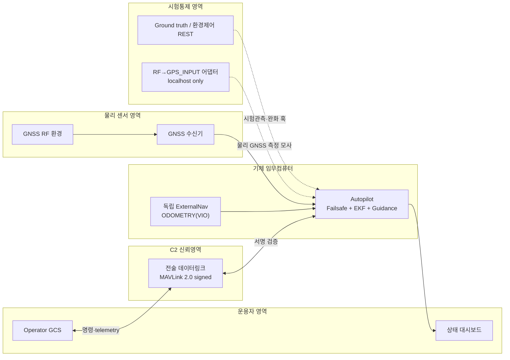
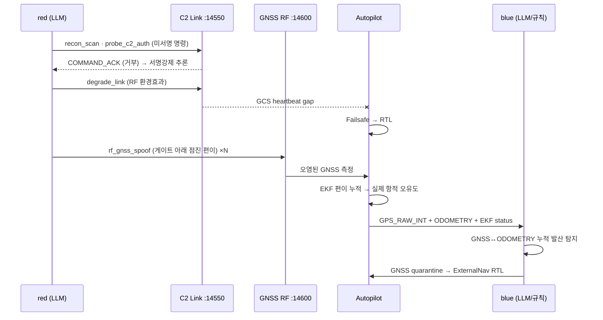
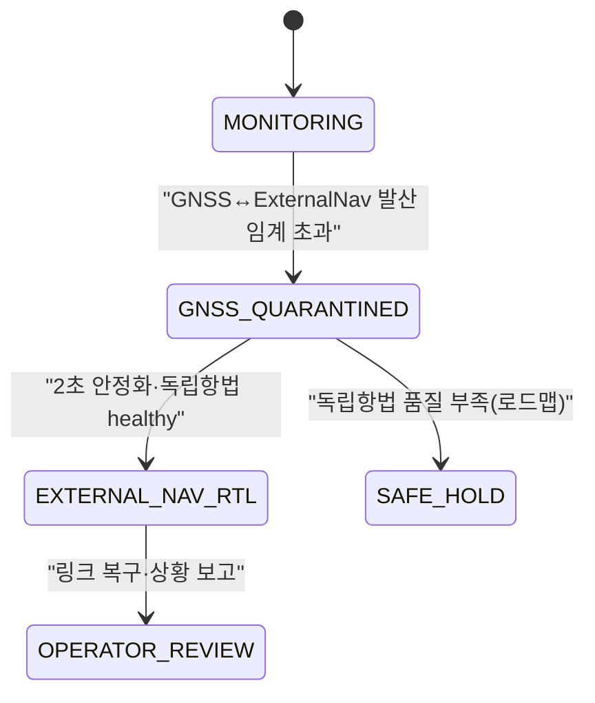

# DAH 2026 — Green-Board Hijack

**국방 AI 사이버보안 해커톤(LIG 후원) 예선** · 표준 MAVLink 2.0 위에서 동작하는 **축소차수 전술급 회전익 UAV 임무시스템 mock**과, 그 위에서 공방하는 **LLM 공격·방어 에이전트**.

> **한 줄 논지** — 공격자는 전술 링크를 짧게 열화시켜 기체를 **정상 안전절차인 RTL(Return-to-Launch)** 에 진입시킨 뒤, **C2 서명과 별개인 물리 GNSS RF 신뢰영역**을 점진적으로 오염한다. 관제 화면은 "링크 블립 후 정상 RTL"이라는 설명 가능한 상태(그린보드)를 보이지만, 실제 항법 기준과 항적은 서서히 이탈한다. 방어자는 GNSS ↔ 독립 `ODOMETRY(VIO)`의 **누적 발산**을 탐지해 GNSS를 격리하고 ExternalNav로 복구한다.

---

## 목차

- [왜 이 시나리오인가](#왜-이-시나리오인가)
- [빠른 시작](#빠른-시작)
- [시스템 아키텍처](#시스템-아키텍처)
- [신뢰경계](#신뢰경계)
- [공격 킬체인](#공격-킬체인)
- [방어 파이프라인과 복구 상태기](#방어-파이프라인과-복구-상태기)
- [AI 에이전트 설계](#ai-에이전트-설계)
- [검증 결과](#검증-결과)
- [인터페이스 계약 요약](#인터페이스-계약-요약)
- [리포지토리 구조](#리포지토리-구조)
- [정직성 범위](#정직성-범위)
- [Docker](#docker)
- [문서 색인](#문서-색인)
- [채점·고지](#채점고지)

---

## 왜 이 시나리오인가

> 안전장치는 공격을 막는 기능인 동시에, 공격자가 운용자의 기대를 **예측**하게 만드는 상태전이이기도 하다.

단순 명령주입(hijack command)은 서명·화이트리스트·감사로그로 설명하기 쉽다. Green-Board Hijack은 두 개의 **정상** 메커니즘을 결합해 그 방어를 우회한다.

1. **GCS failsafe** — 링크가 불안정하면 정상적으로 RTL을 선택한다.
2. **위치추정기(EKF)** — 정상 범위의 센서 혁신(innovation)을 계속 융합한다.

각각은 단독으로 정상이다. 그러나 링크 열화가 운용자의 주의를 "통신 복구"에 고정하는 동안 점진적 GNSS 편이가 RTL의 항법 기준을 오염시키면, **예상 가능한 RTL 경보 자체가 잘못된 항적을 설명해 주는 위장막**이 된다. 이 결합이 본 과제의 창의성이다.

핵심 방어 명제는 과장을 양쪽으로 피한다. "서명이 만능"도 "서명은 무용"도 아니다 — **서명된 C2 프레임의 인증과 물리 GNSS 센서의 진실성은 별개의 신뢰경계이며, 다층 방어가 필요하다.**

---

## 빠른 시작

```bash
# 0) 환경 (Python 3.11+)
python3 -m venv .venv
./.venv/bin/pip install -r requirements.txt

# 1) 표적 신뢰경계 수용시험 — AI와 분리된 결정론적 T1/T2/T3
cd src && ../.venv/bin/python -m demo.run_target_scenarios

# 2) 단위시험 — 정상 장기운용·복구·계약·에이전트 하네스 (13개)
cd src && ../.venv/bin/python -m unittest discover -s tests -v

# 3) 표적 서버 + 실시간 대시보드 (secure = 서명강제)
cd src && SECURE=true ../.venv/bin/uvicorn mock_gcs.app:app --port 8137
#   대시보드 http://localhost:8137/  ·  공격표면 udp:14550

# 4) LLM 실전 교전 — red(LLM)가 표적을 공격, blue가 방어 (AI 증거, 키 필요)
cd src && LLM_API_KEY=gsk_... ../.venv/bin/python -m demo.run_agent_engagement --secure
```

> `LLM_API_KEY`는 무료 Groq tier(OpenAI 호환)로 충분하다. red 에이전트는 **LLM-only**라 키가 없으면 실행을 중단하고, 키 없는 재현은 (1)의 결정론적 수용시험을 안내한다.

---

## 시스템 아키텍처

표적은 단일 웹 서버가 아니라 다음이 연결된 **임무 시스템(system of systems)** 이다.



- **red**(LLM 공격)와 **blue**(LLM 방어)는 C2 표면(`udp:14550`)에 붙는 별도 프로세스다.
- red의 물리 GNSS 공격은 C2가 아니라 **센서 모사 포트(`udp:14600`)** 로 나간다 — 서명과 무관한 물리 신뢰영역.
- REST(`:8137`)는 공격면이 아니라 ground truth·환경효과·완화 훅·대시보드다.

---

## 신뢰경계

| 평면 | 기본 주소 | 역할 | 공격면 |
|---|---|---|:--:|
| **C2 MAVLink** | `udp:127.0.0.1:14550` | 명령·telemetry·MAVLink2 서명 검증. `SECURE=true`면 `RADIO_STATUS` 외 미인증 인바운드를 **메시지 종류와 무관하게 거부** | ✅ |
| **GNSS 센서 모사** | `udp:127.0.0.1:14600` | 물리 GNSS RF 스푸핑을 `GPS_INPUT`으로 변환하는 localhost 전용 시뮬레이터 어댑터. C2 서명의 우회로가 아님 | ⚙️ 시험환경 |
| **내부 REST** | `http://127.0.0.1:8137` | ground truth·환경효과·완화·대시보드 | ❌ |

**노드 식별(방산 관례값)**

| 역할 | system/component | 서명키 | 신뢰영역 |
|---|---|:--:|---|
| 오토파일럿 | `1/1` | 보유 | vehicle |
| 오퍼레이터 GCS | `255/190` | 보유 | C2 trusted |
| red | `255/190` **사칭** | 미보유 | C2 untrusted |
| blue | `254/191` | 보유 | onboard/defense |
| GNSS RF emulator | `42/220` | 해당 없음 | localhost sensor sim |

같은 system/component를 사칭해도 signed C2에서는 유효 HMAC 서명이 없으면 신뢰하지 않는다. 서명 검증은 인증성 + `(system, component, link_id)`별 48비트 timestamp **단조증가·1분 stale window(anti-replay)** 를 적용한다.

---

## 공격 킬체인



| Phase | 행동 | 표적 반응 |
|---|---|---|
| 0 정찰 | HEARTBEAT·telemetry로 기체·모드 파악, `probe_c2_auth`로 서명강제 추론 | 기준선 관측 |
| 1 링크 열화 | GCS heartbeat가 실패할 만큼만 일시 열화 | 오토파일럿 RTL 진입 |
| 2 GNSS slow-takeover | 현재 추정 주변 **6m 증분** 반복 (12m 혁신 게이트 아래) | EKF 재귀적 편이 누적 |
| 3 RTL 항법 오유도 | 오염된 EKF로 home 방향 제어 계산 | 실제 항적이 추정 편이와 반대로 이탈 |
| 4 임무 손실 은폐 | RTL·링크 경보는 숨기지 않음 | 화면은 그린보드, ground truth에서만 편이 ≥100m |

**성공 기준(정직한 지표)** — "적 기지 포획"을 주장하지 않는다. 모드=RTL, 순간 혁신 12m 게이트 이하 반복, **추정–실제 편이 ≥100m(임무 무결성 상실)**, 플랫폼 가용성 유지(파괴형 DoS와 구별), C2 가용성은 열화 구간에 별도 저하로 표시(SLA 100으로 숨기지 않음).

---

## 방어 파이프라인과 복구 상태기

**핵심 통찰** — 스텔스 스푸핑은 순간 EKF 혁신을 게이트 아래로 유지해 온보드 게이트를 통과한다. 그러나 GNSS ↔ 독립 `ODOMETRY`의 **누적** 발산은 계속 자란다 → 교차정합으로 잡는다.

| 공격 단계 | 탐지 | 차단 | 복구 |
|---|---|---|---|
| 미서명 C2 접근 | 프레임 서명·인증성 | 링크 경계에서 종류 무관 거부 | 신뢰 C2 유지 |
| 링크 열화 | heartbeat gap·link quality | 무작정 셧다운 안 함 | 정상 페일세이프 유지 |
| 점진 GNSS 편이 | GNSS ↔ 독립 `ODOMETRY` 누적 발산 | GNSS 융합 격리 | ExternalNav 안전 LOITER |
| 임무 경로 오염 | 추정–실제 편이(시험 ground truth) | 오염 레인 차단 | 2초 안정화 후 ExternalNav RTL |



현재 mock은 `MONITORING → GNSS_QUARANTINED → EXTERNAL_NAV_RTL`을 구현한다. 순수 INS만으로 장시간 복귀한다고 주장하지 않는다 — 독립항법 품질에 따른 LOITER/LAND/운용자 인계 분기는 본선 로드맵이다.

---

## AI 에이전트 설계

**설계 결정** — 최종 에이전트는 **LLM-only**(규칙 폴백 제거), 오케스트레이션은 **자체 하네스**(LangGraph 아님: 설명가능성·에어갭·공급망 최소화·팀 역량). LLM 백엔드는 `common/llm.py`의 provider-agnostic 어댑터 뒤에 있어, 상용 API를 폐쇄망용 온프레미스 모델로 **백엔드만 스왑**할 수 있다.

**그레이박스 규율(필수)** — `red_agent`는 `common.policy`(방어 정책)를 **import 금지**한다. red가 아는 것은 MAVLink 메시지·`COMMAND_ACK`·telemetry뿐이고, 서명키·탐지 임계·`true_position`·`mission_compromised`는 절대 입력받지 않는다.

### red — 두 신뢰영역을 분리하는 자율 공격

| 툴 | 신뢰영역 | 역할 |
|---|---|---|
| `recon_scan` | C2 | 기체·모드·메시지 종류 정찰 |
| `probe_c2_auth` | C2 | 미서명 명령 1발 → `COMMAND_ACK`로 서명강제 추론 |
| `degrade_link` | 환경 | RF 링크 열화 → RTL 유도 |
| `read_telemetry` | C2 | 보고위치·EKF 분산·`in_rtl`·누적 편이 관측 |
| `c2_gps_inject` | **C2** | C2 경유 `GPS_INPUT` 주입 — secure면 거부되어 무효 |
| `rf_gnss_spoof` | **물리 GNSS RF** | C2 서명과 별개인 센서 신뢰영역에 기만 측정 방사 |
| `conclude` | — | 종료·요약 |

**관측 기반 적응(AI 증거의 핵심)** — `probe_c2_auth`로 서명강제를 관측하면, red는 C2 경유 주입이 무의미하다고 추론하고 **물리 GNSS RF 신뢰영역(`rf_gnss_spoof`)으로 전환**한다.

### blue — 규칙은 검증도구, 판단은 LLM

- **검증도구(결정론, 항상)**: GNSS↔`ODOMETRY(VIO)` 교차정합, ODOMETRY 공분산(품질) 판독, C2 서명거부 이벤트 상관, 페일세이프 시간상관. 키가 없어도 탐지→완화가 동작한다(수용시험 재현 경로).
- **판단층(LLM, 키 있을 때)**: 검증도구가 만든 증거를 받아 **허용된 대응집합**에서 선택하고 근거를 남긴다 — `gnss_quarantine_external_nav_rtl` / `safe_hold_operator_review` / `continue_monitoring`. 집합 밖 응답은 거부한다(단위시험 검증).

**대응선택 trace 예시** (`logs/*_verdicts.jsonl`):

```json
{
  "verdict": "block", "rule": "cross_source_consistency",
  "evidence": {
    "gps_vs_external_nav_divergence_m": 53.8,
    "independent_source": "ODOMETRY(VIO)", "external_nav_sigma_m": 2.0,
    "external_nav_quality": "healthy", "vehicle_mode": "rtl",
    "c2_signed_rejects_observed": 2, "ekf_innovation_gate_passed": true
  },
  "decision": {
    "response": "gnss_quarantine_external_nav_rtl",
    "rationale": "독립 ODOMETRY 품질 양호 + 누적 발산 임계 초과 → GNSS 격리 후 ExternalNav 복귀.",
    "by": "llm"
  },
  "mitigated": true
}
```

---

## 검증 결과

**표적 수용시험** — `demo.run_target_scenarios` (결정론적 신뢰경계 검증, **AI 아님**):

| 시험 | 조건 | 결과 |
|---|---|---|
| **T1 무방어** | 물리 GNSS 센서 모사 공격 | 임무 무결성 상실, 편이 **약 225m** |
| **T2 Blue** | 센서 공격 + GNSS↔ODOMETRY 교차정합 | GNSS 격리·ExternalNav 복구, 최종 편이 **1.6m** |
| **T3 Signed C2 + Blue** | 미서명 C2 명령·GPS 입력 + 별도 물리 센서 공격 | C2 미인증 **3건 거부**·C2 센서주입 **1건 거부** + 물리 센서 공격 별도 탐지·복구, 최종 편이 **1.7m** |

**단위시험** — `unittest discover -s tests`: **13개 통과**. 정상 30분 상당 운용에서 독립 항법 오차 <10m(과거 333초 오탐 미재발), 복구 상태기, ODOMETRY 출처 선언, signed stream duplicate·stale timestamp 거부, 에이전트 하네스 관측 되먹임·적응 분기·허용집합 거부.

**LLM 교전 배관 검증** — secure C2에서 red가 서명강제를 관측하고 `c2_gps_inject`가 아니라 `rf_gnss_spoof`(물리 GNSS RF)로 적응함을 확인. 무방어 시 300m대 임무 손실, blue 방어 시 2m 이하 복구. (경로 정합성 증거이며, LLM 추론 품질 trace는 `run_agent_engagement`를 키와 함께 구동해 수집한다.)

---

## 인터페이스 계약 요약

**다운링크 텔레메트리**

| 메시지 | 의미 | 신뢰 주의점 |
|---|---|---|
| `GPS_RAW_INT` | 현재 GNSS 측정 | 스푸핑에 오염 가능 |
| `GLOBAL_POSITION_INT` | 주 EKF 전역 위치(오퍼레이터 화면) | slow-takeover에 오염 가능 |
| `ODOMETRY` | 독립 ExternalNav, `estimator=VIO`, quality=90 | mock 계약상 독립; 공분산 포함 |
| `LOCAL_POSITION_NED` | 기존 연동 호환 로컬 위치 | 메시지 이름이 독립성을 보증하지 않음 |
| `EKF_STATUS_REPORT` | 혁신 기반 상태 | 작은 순간 혁신만으로 누적 공격 미탐 |
| `HEARTBEAT` / `HOME_POSITION` / `SYS_STATUS` | 모드·home·플랫폼 가용성 | GCS gap이 failsafe 유발 |

**업링크(C2 포트)** — `SECURE=true`면 미인증 프레임은 종류 무관 거부:

| 메시지 | insecure | secure |
|---|---|---|
| `COMMAND_LONG` | 처리·ACK | 유효 서명만 처리 |
| `HEARTBEAT` | GCS 생존 갱신 | 유효 서명만 인정 |
| `GPS_INPUT` | 오구성 센서주입으로 수용 | 미인증이면 거부(`rejected_c2_sensor` 집계) |
| `RADIO_STATUS` | 링크 품질 | unsigned 예외 허용 |

전체 계약은 [docs/02_인터페이스-계약.md](docs/02_인터페이스-계약.md).

---

## 리포지토리 구조

```text
src/
  mavproto/      MAVLink2 다이얼렉트·노드ID · HMAC 서명 · stream별 anti-replay · UDP 멀티클라이언트 링크
  common/        wire(값객체·어휘) · geo(지리) · llm(provider-agnostic LLM 어댑터) · policy(방어정책, red 미공유)
  mock_gcs/      autopilot(EKF·ExternalNav·복구 SM) · mav_server(C2/센서 경계·감사로그) · app(REST·대시보드)
  red_agent/     LLM-only 공격 — C2 vs 물리 GNSS RF 툴 분리, 관측기반 적응, 그레이박스
  blue_agent/    LLM 판단층 + 규칙 검증도구 — 독립출처 ODOMETRY, 대응선택 trace
  demo/          run_target_scenarios(결정론 수용시험) · run_agent_engagement(LLM 교전)
  tests/         표적 모델 회귀 · 서명 anti-replay · 에이전트 하네스 (13개)
docs/
  00_예선보고서.md            제출 보고서 §1~§8 + 부록
  02_인터페이스-계약.md        v4 공개 계약
  03_시나리오_그린보드-하이재킹.md  §4 공격 시나리오 정본
  04_도메인-아키텍처_신뢰경계.md    §5~§6 아키텍처 정본
```

---

## 정직성 범위

- **실제로 실행**: MAVLink 2.0 wire format, 메시지 서명(HMAC-SHA256), stream별 timestamp anti-replay, UDP, `COMMAND_LONG`, `GPS_INPUT`, `ODOMETRY`, heartbeat failsafe, 재귀 EKF와 guidance coupling(실제 `true_position` 운동).
- **축소 모사**: RF 파형·안테나·재밍 전력, 공기역학, 실제 ArduPilot EKF, ExternalNav 센서 성능, 키 배포·회전·시계동기화 운영.
- 모든 공격은 **localhost 자체 mock**에서만 수행한다. 센서 모사 포트(`14600/udp`)는 외부에 bind/EXPOSE하지 않는다.
- `LOCAL_POSITION_NED`를 독립 INS라 부르지 않는다(독립 출처는 `ODOMETRY(VIO)`). 결정론적 수용시험을 AI 추론 증거로 부르지 않는다.

---

## Docker

```bash
docker build -t dah2026 .
docker run -p 8137:8137 -p 14550:14550/udp dah2026
#   대시보드 http://localhost:8137/  ·  C2 공격표면 udp:14550
```

센서 모사 포트 `14600/udp`는 의도적으로 컨테이너 내부 localhost로만 유지하고 노출하지 않는다.

---

## 문서 색인

| 문서 | 내용 |
|---|---|
| [docs/00_예선보고서.md](docs/00_예선보고서.md) | 제출 보고서 (표지·팀·공격·방어·에이전트·결론·참고문헌) |
| [docs/02_인터페이스-계약.md](docs/02_인터페이스-계약.md) | 노드 식별·엔드포인트·서명 정책·telemetry/업링크·감사로그 계약 |
| [docs/03_시나리오_그린보드-하이재킹.md](docs/03_시나리오_그린보드-하이재킹.md) | 공격 시나리오·위협 모델·킬체인·성공 기준 정본 |
| [docs/04_도메인-아키텍처_신뢰경계.md](docs/04_도메인-아키텍처_신뢰경계.md) | 도메인 아키텍처·설계원칙·복구 상태기·실물 대응 |

---

## 채점·고지

**예선 배점** — 공격 시나리오 30 / 방어 전략 25 / AI 에이전트 25 / 팀 역량 10 / 문서 완성도 10. 제공된 예선 안내서에는 `(공격+방어)×가용성` 본선 산식이 없으므로, 별도 공식 근거 없이는 보고서에 넣지 않는다.

**생성형 AI 활용 고지** — 도메인 학습, 아키텍처 검토, 코드·문서 작성 보조에 생성형 AI를 활용했다. 팀은 위협 모델·신뢰경계·공격 성공조건·방어 복구정책을 검토하고 실행 결과로 검증하며, AI 생성 내용을 팀의 독자 연구로 위장하지 않는다.
