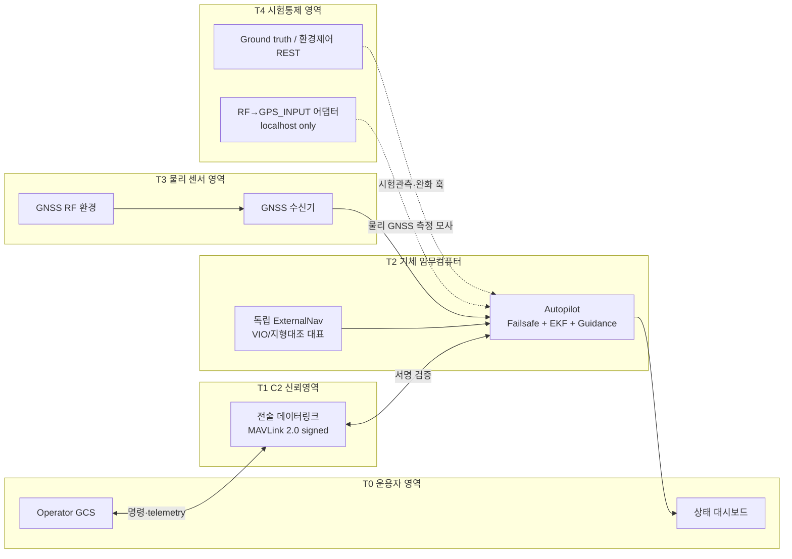
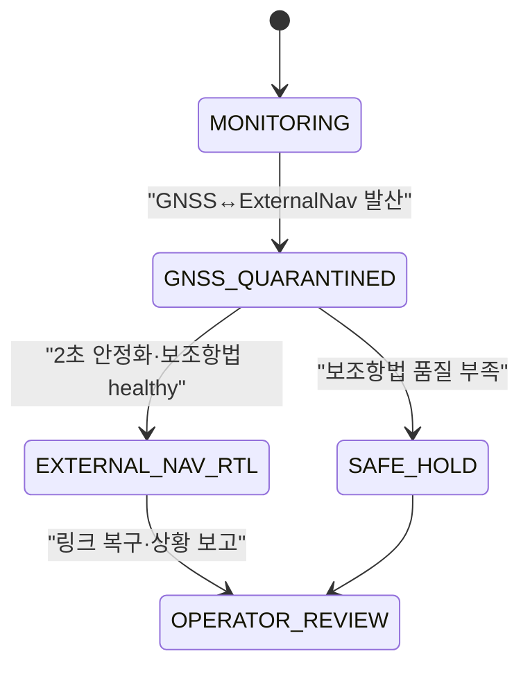
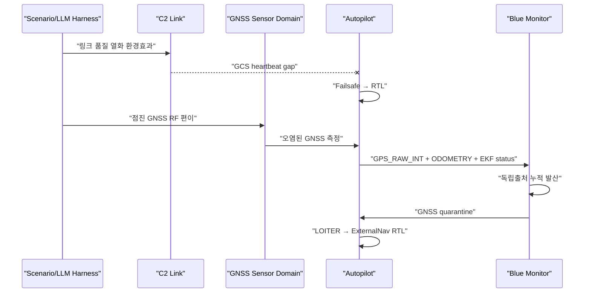

# 도메인 아키텍처 — UAV C2와 센서 신뢰경계

> 보고서 §4~§6 공통 아키텍처 정본. 자체 mock을 실제 방산 시스템과 동일하다고 과장하지 않고, 무엇을 실물 규약으로 구현했고 무엇을 축소 모사했는지 명확히 구분한다.

## 1. 시스템 관점

Green-Board Hijack의 표적은 단일 웹 서버가 아니라 다음이 연결된 **임무 시스템(system of systems)** 이다.

## 2. 핵심 설계원칙

### 2.1 C2 인증과 센서 진실성은 다른 문제다

MAVLink2 서명은 C2 프레임의 발신자와 무결성을 검증한다. GNSS 수신기가 만든 위치 측정의 물리적 진실성까지 보증하지 않는다. 따라서 secure C2에서 미서명 `GPS_INPUT`을 허용해 이 명제를 증명하지 않는다.

- signed C2의 미인증 명령·센서 메시지: **거부**
- GNSS RF 오염: 별도 센서 신뢰영역의 공격으로 모델링
- 방어: C2 서명 + 센서 다중화/교차정합의 다층구조

### 2.2 표준 메시지 이름만으로 출처 독립성을 가정하지 않는다

`LOCAL_POSITION_NED`는 필터링된 로컬 위치이지 자동으로 GPS 비의존 INS가 아니다. mock은 독립 보조항법을 `ODOMETRY(estimator_type=VIO)`로 명시하고, `LOCAL_POSITION_NED`는 기존 연동 호환용으로만 병행한다.

### 2.3 가용성과 링크 품질을 분리한다

- `platform_availability`: 비행제어·상태관측·안전모드가 살아 있는가
- `c2_availability`: 현재 지상–기체 링크 품질
- `mission_integrity`: 실제 항적이 신뢰할 수 있는가

링크가 10%인데 모든 SLA가 100이라고 표현하지 않는다. 플랫폼은 살아 있으나 C2는 저하되고, 임무 무결성은 별도로 실패할 수 있다.

### 2.4 복구는 상태기계다

탐지 즉시 “완료”로 처리하지 않는다.

현재 mock은 `MONITORING → GNSS_QUARANTINED → EXTERNAL_NAV_RTL`을 구현한다. 실배치에서는 품질 부족 시 LOITER/LAND/운용자 인계 분기가 필요하다.

## 3. 구현 컴포넌트

| 컴포넌트 | 책임 | 실물/모사 경계 |
|---|---|---|
| `mavproto` | MAVLink2 다이얼렉트·UDP·HMAC 서명·stream별 anti-replay | 표준 프레임 사용, 키배포·회전 운영은 축소 |
| `mock_gcs.autopilot` | true state·GNSS·ExternalNav·EKF·failsafe·guidance | 비행역학/EKF 수학 축소 |
| `mock_gcs.mav_server` | signed C2 경계·센서 모사 경계·감사로그 | C2/센서 포트를 논리·물리 분리 |
| `mock_gcs.app` | 운영 대시보드·ground truth·환경·완화 훅 | REST는 공격면이 아닌 시험통제 |
| `demo.run_target_scenarios` | T1~T3 표적 수용시험 | 결정론적 시험, AI 에이전트 아님 |
| `tests.test_target_model` | 정상 장기운용·복구·성공지표 회귀검증 | 30분 상당 시간가속 시험 |

## 4. 네트워크 계약

| 평면 | 기본 주소 | 외부 노출 | 허용 입력 |
|---|---|---|---|
| C2 | `udp:127.0.0.1:14550` | 예 | `COMMAND_LONG`, heartbeat, insecure 구성의 `GPS_INPUT` |
| 센서 모사 | `udp:127.0.0.1:14600` | 아니오 | `GPS_INPUT`만 |
| 내부 REST | `http://127.0.0.1:8137` | 아니오 | ground truth·환경제어·완화 |

Docker는 C2와 대시보드만 노출하고 센서 모사 포트는 컨테이너 내부 localhost로 유지한다.

## 5. 텔레메트리 의미

| 메시지 | 의미 | 신뢰 주의점 |
|---|---|---|
| `GPS_RAW_INT` | 현재 GNSS 측정 | 스푸핑에 오염 가능 |
| `GLOBAL_POSITION_INT` | 주 EKF 전역 위치 | GNSS slow-takeover에 오염 가능 |
| `ODOMETRY` | 독립 ExternalNav 위치, VIO 대표 | mock 계약상 독립; 품질·공분산 포함 |
| `LOCAL_POSITION_NED` | 기존 연동 호환 로컬 위치 | 메시지 자체가 독립성을 보증하지 않음 |
| `EKF_STATUS_REPORT` | 혁신 기반 상태 | 작은 순간 혁신만으로 누적 공격을 보장 탐지 못함 |
| `HEARTBEAT` | 기체·GCS 생존과 모드 | GCS gap이 failsafe를 유발 |

## 6. 공격·방어 데이터 흐름

## 7. mock과 실제 배치의 대응

| mock | 실제 배치 후보 |
|---|---|
| 센서 모사 `GPS_INPUT` | GNSS RF simulator, Spirent류 시험장비, HIL 센서 게이트웨이 |
| ExternalNav `ODOMETRY` | VIO, terrain-relative navigation, radar odometry, authenticated secondary GNSS |
| REST 완화 훅 | signed MAVLink EKF source command, onboard Lua, companion policy module |
| `true_position` | 모션캡처·HIL ground truth·시험장 추적기 |
| 축소차수 guidance | ArduPilot SITL/HIL 또는 실제 비행제어기 |

## 8. 안전성과 재현성

- 모든 공격은 localhost 자체 mock에서만 실행한다.
- 센서 모사 포트는 외부에 bind/EXPOSE하지 않는다.
- 로그에는 `trust_domain`을 기록해 C2 공격과 센서 환경 공격을 구별한다.
- 성공 판정은 100m 임무 무결성 임계로 고정하며 단순 EKF 게이트 초과를 하이재킹으로 부르지 않는다.
- 표적 수용시험은 명시적 assert로 회귀 실패를 검출한다.
- AI 에이전트 평가는 이 결정론적 시험과 분리한다.

## 9. 본선 확장

1. ArduPilot SITL/HIL로 target adapter 교체
2. 실제 `MAV_CMD_SET_EKF_SOURCE_SET` 또는 onboard policy로 완화 경로 교체
3. GNSS·ExternalNav covariance와 시간가변 임계 도입
4. 회전익 → VTOL/UGV 별 dynamics adapter 분리
5. LLM-only red/blue agent를 동일 공개 계약에 연결

이 확장은 하네스의 tool interface를 유지하면서 target adapter만 바꾸도록 설계한다.
